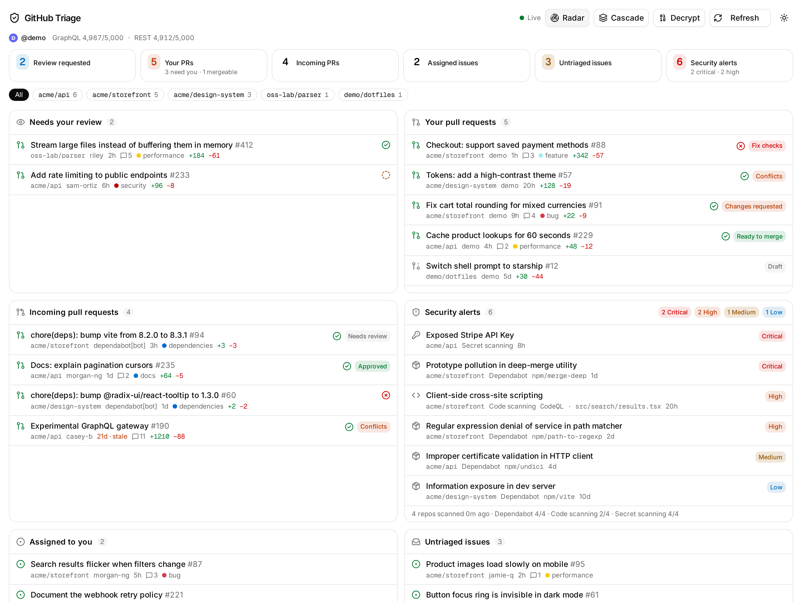
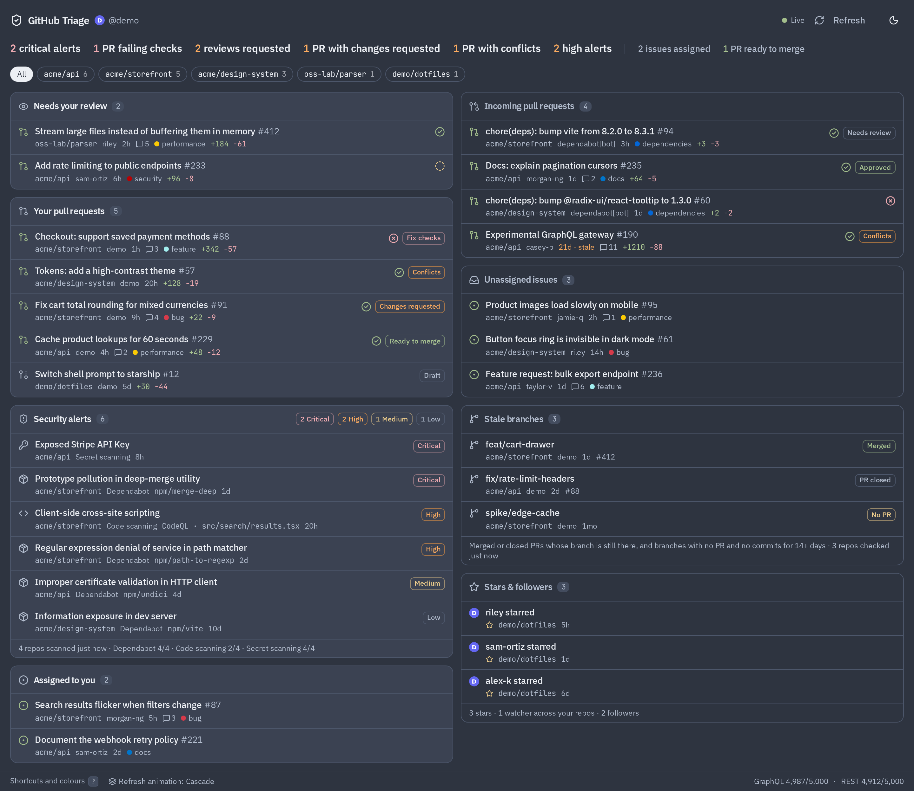

# GitHub Triage

One pane for everything on GitHub that's waiting on you: pull requests, issues and security alerts. It updates in real time: when a PR is opened, reviewed or its checks finish, just that row changes on screen within a couple of seconds, with no reload.

> **A personal tool.** This is built for my own use and shared as-is. It currently supports **one GitHub account** per deployment: a single login (`ALLOWED_LOGINS`) whose tokens, cache and live updates live in one Durable Object. Supporting several people would need per-user storage and routing webhooks to the right users. Feel free to deploy your own copy.

**Light**



**Dark**



| Panel | What's in it |
| --- | --- |
| **Needs your review** | Open PRs where your review is requested |
| **Your pull requests** | Your open PRs, sorted by next step: fix checks → resolve conflicts → address review → ready to merge → awaiting review → draft |
| **Incoming pull requests** | PRs from others (including Dependabot) on your repos |
| **Security alerts** | Open Dependabot, code scanning and secret scanning alerts across your repos, by severity |
| **Assigned to you** | Open issues assigned to you |
| **Untriaged issues** | Open issues on your repos with no assignee |

Click any repo name (or a chip) to filter everything to that repo; the filter lives in the URL (`?repo=owner/name`). Items untouched for 14+ days are marked stale.

The app only reads from GitHub, with one exception: **Fix with Claude** posts the comment you write (below).

## Running it

```sh
cp .dev.vars.example .dev.vars     # then set GITHUB_TOKEN, e.g. from `gh auth token`
pnpm install
pnpm dev                           # http://localhost:5173
```

`pnpm dev` runs the real Worker and Durable Object locally (workerd, via `@cloudflare/vite-plugin`), so what you test is what deploys. Without a GitHub App configured, the app runs in **local mode**: it uses your token, skips sign-in, and refuses any host other than localhost. The token stays server-side. To host it, deploy to Cloudflare (below), which adds GitHub sign-in.

### Security alert coverage

Security alerts are fetched per repo (3 calls each, up to `TRIAGE_MAX_REPOS`). When a scanner has no data for a repo, the panel footer says whether it's turned off or whether the token lacks permission (HTTP 403), so an empty list is never a false all-clear. The `gh` CLI's default token has no `security_events` scope; add it with `gh auth refresh -s security_events`.

The scan runs in the background in small batches, never inside a page request: see [Security scans](#security-scans) below.

### Stars & followers

The **Stars & followers** panel lists the latest stars and new watchers on repos you own and your newest followers, from one GraphQL request. Stars carry GitHub's timestamp and arrive live through the Star webhook. GitHub won't list a repo's stargazers to the App's sign-in token, so on the deployed app the Hub records stars from those webhooks instead, and only stars from after it started recording are shown. GitHub has no follow webhook and doesn't document follow times, so followers are checked every five minutes. Their follow time is read from GitHub's follower cursor, which happens to encode it; if that ever stops working, a follower is dated from when the dashboard first saw them. Watchers have neither a webhook nor any date, so they're always dated from when the dashboard first saw them; people already watching when tracking started aren't listed.

### Fix with Claude

Issue rows in **Assigned to you** and **Untriaged issues** have a ✦ button. It opens a comment starting with `@claude` that you can edit, and posts it on the issue. The [Claude GitHub Action](https://github.com/anthropics/claude-code-action) then picks it up and works on a fix. When the popover opens, the Hub checks that repo's `.github/workflows` for the Action. If it's missing, the popover says so and won't post, because nothing would answer. Set the Action up by running `/install-github-app` in Claude Code in that repo.

After you post, the row shows how far the run has got: *Asked Claude*, then *Claude working* when `claude[bot]` comments, then *Branch ready* when it pushes `claude/issue-<n>-…`, which links to the compare view to open the PR. If a PR is opened from that branch, the row shows *PR opened*. Progress arrives through the Issue comment, Push and Pull request webhooks. While Claude is still picking the run up or working, the tab also polls every 30 seconds. On those reads the Hub checks GitHub directly for Claude's comment, the branch and a PR from it, so runs advance in local mode (no webhooks) and after a missed delivery. It stops checking once a run reaches a PR or is a day old.

This is the only write, so it needs write access to issues: **Issues: Read and write** on the GitHub App, or a token that can comment in local mode. Without it, GitHub's 403 is shown in the popover.

### Caching

The Hub Durable Object is the only cache. It keeps the PR/issue inbox (a single GraphQL request) for about a minute the last security scan for 15 minutes, and stars & followers for five minutes. **Refresh** refetches the inbox and stars & followers; webhook events also expire it, so the next page load is fresh. In the browser, TanStack Query shares each response across components.

## Deploying to Cloudflare

Deployed, the app is one Cloudflare Worker. You sign in with GitHub, and changes on GitHub are pushed to open tabs as they happen.

### How it fits together

The browser app is a static Vite + React SPA. The Worker (`src/worker/index.ts`, Hono) never renders HTML; it handles:

| Path | What it does |
| --- | --- |
| `/auth/login`, `/auth/callback`, `/auth/logout` | GitHub App OAuth. Only logins in `ALLOWED_LOGINS` get a session (a signed, HttpOnly cookie). Tokens never reach the browser. |
| `/api/github/webhook` | GitHub App webhooks, verified with `X-Hub-Signature-256`. The only path that doesn't need a session. |
| `/api/inbox`, `/api/security`, `/api/rate-limits`, `/api/refresh`, `/api/session` | JSON for the app, each a single call to the Hub. Typed end to end with Hono RPC (`src/client/api.ts`). |
| `/api/live` | The dashboard's WebSocket. |
| everything else | The SPA's static files, behind the session check. |

The **Hub** Durable Object (`src/edge/hub.ts`) holds your OAuth tokens and refreshes them. Refresh tokens are single-use, so there's exactly one place that refreshes. It also holds the open tabs' WebSockets, which hibernate so idle tabs cost nothing, and it turns changes into small updates:

- A webhook is reduced to the one PR or issue it's about (`src/edge/events.ts`). A 1.5s debounce collapses bursts, such as 20 check suites finishing, into **one** GraphQL request for just those items. Each item is then filed into panels with the same rules as the inbox searches (`sectionsFor` in `src/lib/triage.ts`), and only that item is pushed.
- Security alert webhooks carry the alert itself, so they're pushed with no API call.
- With no tab open, the Hub does no work. It only notes that something changed, and the next tab to open resyncs once.

The browser overlays these updates on the snapshot it fetched. A row that arrives or changes glows once. If a tab could have missed something (it was offline, or it was rendered from an older cached snapshot), it runs **Refresh** once.

### Setup

1. **Create a GitHub App** (Settings → Developer settings → GitHub Apps → New):
   - Callback URL: `https://<your-host>/auth/callback`. Leave **Expire user authorization tokens** on.
   - Webhook URL: `https://<your-host>/api/github/webhook`, with a random secret.
   - Repository permissions: **Issues: Read and write** (only for [Fix with Claude](#fix-with-claude)); everything else **read-only**: Metadata, Pull requests, Checks, Commit statuses, Contents, Dependabot alerts, Code scanning alerts, Secret scanning alerts. Organization permission: Members (read), so team review requests count.
   - Subscribe to events: Pull request, Pull request review, Issues, Issue comment, Check suite, Push, Repository, Star, Dependabot alert, Code scanning alert, Secret scanning alert. Installation events are sent to every App anyway.
   - Generate a client secret, then **install** the App on your account and on any orgs in `TRIAGE_OWNERS`.
2. **Set the configuration.** Put `ALLOWED_LOGINS` (your login) and optionally `TRIAGE_OWNERS` in `wrangler.jsonc` → `vars`. Then add the secrets:
   ```sh
   pnpm wrangler secret put GITHUB_CLIENT_ID
   pnpm wrangler secret put GITHUB_CLIENT_SECRET
   pnpm wrangler secret put GITHUB_WEBHOOK_SECRET
   pnpm wrangler secret put SESSION_SECRET        # e.g. openssl rand -hex 32
   ```
3. `pnpm run deploy` (plain `pnpm deploy` is a pnpm built-in)

To try sign-in locally, fill in the OAuth section of `.dev.vars` with a second GitHub App whose callback is `http://localhost:5173/auth/callback`. After changing bindings in `wrangler.jsonc`, run `pnpm cf-typegen`.

### What sign-in changes

- The OAuth token only sees **private** repos where the App is installed. Public repos are unaffected. A review request on someone else's private repo, where your App isn't installed, won't show up.
- Security scans cover the repos the App is installed on (capped by `TRIAGE_MAX_REPOS`), not the owners in `TRIAGE_OWNERS`.

### Security scans

A scan is 3 GitHub calls per repo, which can be well over Cloudflare Workers' per-invocation subrequest limit. So the Hub Durable Object owns scanning instead of any request: it runs a bounded batch of repo/scanner calls per alarm tick (`src/edge/hub.ts`), checkpointing progress in its own storage and resuming on the next tick until a full pass completes, then stores the result. The dashboard just reads whatever the Hub last finished. A page load only kicks off a new scan when the stored one is missing or older than 15 minutes; while a scan is running (typically only ever on first deploy) the panel shows "Scanning" instead of an error.

### Realtime coverage

| Where | How it updates |
| --- | --- |
| Repos with the App installed | Webhooks, typically within about 2s |
| Other repos (e.g. a review request on a public repo) | A search for PRs and issues involving you that changed since the last check, every 2 minutes and only while a tab is open |
| Checks on PRs from forks, commit statuses (the older API that some CI services still use) | On the next Refresh or resync |

## Development

Open the repository in its dev container (VS Code: **Dev Containers: Clone Repository in Container Volume**). The container provides Node.js 24, pnpm via Corepack, the GitHub CLI and Claude Code. Claude's configuration lives in a per-container volume, so run `claude` once to sign in and `gh auth login` to authenticate the GitHub CLI.

```sh
pnpm test        # Vitest: triage rules, alert normalization, auth, webhooks
pnpm typecheck
pnpm lint
pnpm build
pnpm screenshots # regenerate docs/screenshots from fictional data
```

`pnpm screenshots` runs the real app against a fake GitHub API (`scripts/screenshots/`) with made-up users, repos and alerts, then saves light and dark screenshots with Playwright. It uses its own Worker config and throwaway state, so it never reads your `.dev.vars` or touches your account. If Chromium is missing, run `pnpm exec playwright install chromium`.

Stack: Vite + React 19 SPA, Hono on Cloudflare Workers, a Durable Object as the store (tokens, cache, live updates), TanStack Query, TypeScript, Tailwind CSS 4, shadcn/ui (radix-vega), Zod at the GitHub API boundary, Lucide, Motion, next-themes (a plain React library, despite the name).

`GITHUB_API_URL` points the app at a different API root (GraphQL at `${GITHUB_API_URL}/graphql`), which is handy for testing against a mock server.

Layout: `src/client/` is the browser entry (API client, URL state). `src/worker/index.ts` is the Worker. `src/edge/` is the Cloudflare side: auth, webhooks, the Hub Durable Object and the live protocol. `src/lib/github/` does the GitHub reads (inbox, security, HTTP). `src/lib/triage.ts` holds the pure rules and schemas. `src/components/triage/` is the UI.
